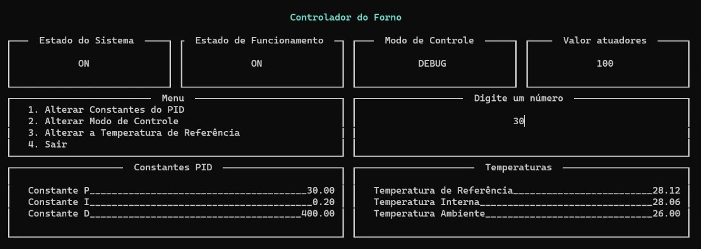
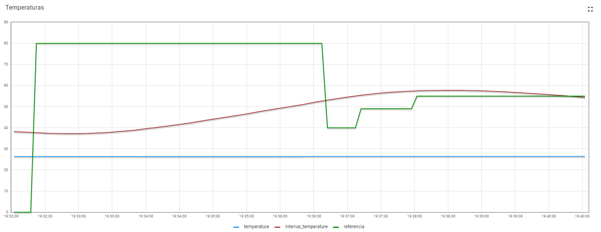
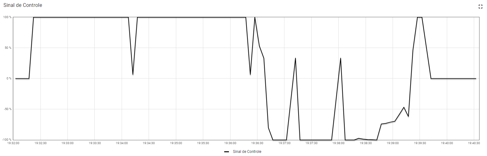

# Trabalho 2 - Fundamentos de Sistemas Embarcados

## Especificação

A especificação do trabalho pode ser encontrada [aqui](https://gitlab.com/fse_fga/trabalhos-2022_2/trabalho-2-2022-2).

## Instalação

### Python

Primeiro devemos instalar as dependências do Python

```bash
# Criando um ambiente virtual para a instalação
python3 -m venv venv
# Ativando o ambiente virtual
source venv/bin/activate
# Atualizando o pip
python3 -m pip install -U pip
# Instalando as dependências
pip3 install -r requirements.txt
```

### C

Este projeto utiliza tanto a linguagem `Python` quanto a linguagem `C`, então precisamos compilar as bibliotecas escritas em `C`. Para isso, basta executar o comando abaixo.

```bash
make
```

Pronto, instalação concluída!!

## Como usar

### Interface

Para o uso adequado do _software_ é necessário tomar cuidado com o tamanho do terminal, pois a pesar das "caixinhas" da interface serem responsivas, caso não haja espaço suficiente para mostrar todos os dados ele irá parar a execução.

Na **Figura 1** podemos ver a interface e seus componentes.


<h6 style="text-align:center">Figura 1: Interface</h6>

Como podemos ver na figura acima, a interface apresenta algumas informações que são atualizadas de tempos em tempos, são elas:

- Estado do Sistema: Indica se o sistema está ligado ou desligado
- Estado de Funcionamento: Caso esteja ligado, o _software_ irá acionar o resistor/ventoinha para que a `Temperatura Interna` do forno chegue à `Temperatura de Referência`
- Modo de Controle: Indica de onde o sistema pegará a `Temperatura de Referência` que será utilizada. Ele possui três valores possíveis:
    - DEBUG: A `Temperatura de Referência` será definida via terminal.
    - CURVE: A `Temperatura de Referência` será definida via arquivo de configuração da [**Curva de Reflow**](./src/utils/reflow.csv).
    - DASHBOARD: A `Temperatura de Referência` será definida via Dashboard.
- Valor atuadores: Valor percentual de acionamento dos atuadores (Resistor/Ventoinha). Valores positivos para Resistor e negativos para Ventoinha.
- Menu: Possíveis ações que o usuário pode realizar.
- Digite um número: Esse campo é utilizado apenas quando o usuário está definindo um valor para alguma constante do PID ou para a `Temperatura de Referência`.
- Constantes PID: As constantes que serão utilizadas no controle PID (Proporcional Integral Derivativo).
- Temperaturas: Apresenta as temperaturas as temperaturas do sistema.
    - Temperatura de Referência: Temperatura alvo do forno.
    - Temperatura Interna: Temperatura atual do forno.
    - Temperatura Ambiente: Temperatura ambiente.

### Navegação

#### Menu

Para navegar nos menus é possível utilizar as setinhas do teclado, ou as teclas `j` e `k` para navegar para baixo e para cima respectivamente. As setinhas esquerda e direita ou `h` e `l` correspondem a navegação cima e baixo respectivamente. Para executar a ação que está selecionada aperte a tecla `Enter`. Para voltar para o _Menu Principal_ aperte `Esc`.

#### Digite um número

Quando uma das opções de alterar alguma constante do PID ou a `Temperatura de Referência` for selecionada aparecerá um cursor no centro da seção **Digite um número** indicando que esta seção está ativa. Neste momento você pode digitar qualquer número ponto flutuante válido e apertar `Enter` para confirmar ou `Backspace` para apagar o último carácter inserido. Vale lembrar que a qualquer momento é possível apertar a tecla `Esc` para voltar ao _Menu Principal_.

### Dashboard

Na **Figura 2** temos uma demonstração da variação das temperaturas em um intervalo de 10 minutos.


<h6 style="text-align:center">Figura 2: Temperaturas</h6>

Na **Figura 3** temos uma demonstração da variação do sinal de controle (Resistor/Ventoinha) no mesmo intervalo da **Figura 2**.


<h6 style="text-align:center">Figura 3: Sinal de controle</h6>
